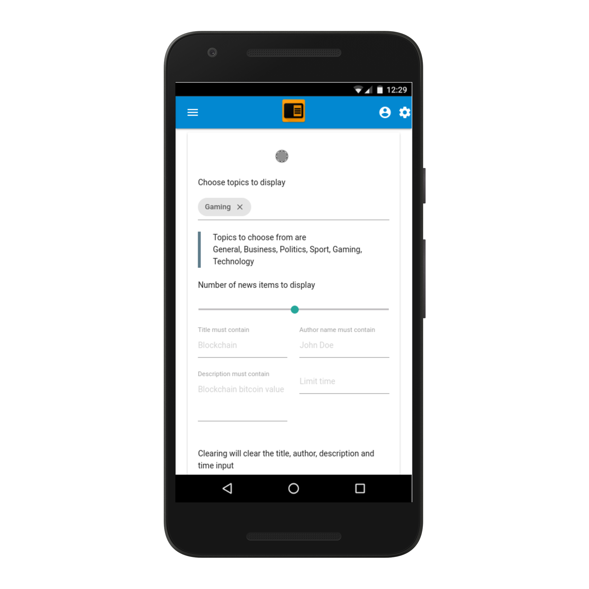

# flato

A modern news aggregation site 

### User account:

user : *_webtech_*  
pass : *_testthis_*


Wget commando to preform automatic update database.

```
while /bin/true; do wget -qO- http://127.0.0.1:8000/updatedb &> /dev/null  && sleep 10; done
```




# To do list :
- [ ] frontpage dashboard with apis
- [ ] User history -> notifications from threads
- [ ] topics data api (movies,news,etc) ->
- [x] Automatically fetch news in an hack manner
- [x] chat/comment system
- [x] Filter out already fetched news
- [x] Create account
- [X] Performance lookup large database  postgress has very very good performance
- [X] rest api
- [x] account login
- [X] new link generator
- [X] Search topic


## Extra: 


- infinite scroll
- playable games
- downloadable data dribble
- Set date interval
